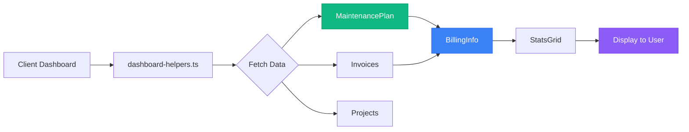

# Client Dashboard - Consolidation Complete ✅

**Date:** February 3, 2026  
**Status:** Fixed & Ready

## What Was Fixed

### 🔧 Core Issue Resolved

**File:** `src/lib/dashboard-helpers.ts` (getBillingInfo function)

**Problem:**
- Was checking old `project.stripeSubscriptionId` field (doesn't exist)
- Was checking old `project.maintenancePlan` field (doesn't exist)  
- Was checking old `project.maintenanceStatus` field (doesn't exist)

**Solution:**
```typescript
// ❌ OLD (BROKEN)
hasActiveSubscription: !!project?.stripeSubscriptionId && project.maintenanceStatus === 'ACTIVE',
subscriptionPlan: project?.maintenancePlan || undefined,

// ✅ NEW (FIXED)
// Now properly queries MaintenancePlan relationship
const maintenancePlan = await prisma.maintenancePlan.findFirst({
  where: {
    projectId: project.id,
    status: 'ACTIVE',
  },
});

hasActiveSubscription: !!maintenancePlan,
subscriptionPlan: maintenancePlan?.tier || undefined,
```

## Client Dashboard Status

### ✅ Already Correct (No Changes Needed)

1. **Client Subscriptions Page** (`/client/subscriptions`)
   - ✅ Properly uses `maintenancePlanRel` relationship
   - ✅ Converts MaintenancePlan data for display
   - ✅ Uses ESSENTIALS/DIRECTOR/COO tiers correctly

2. **Client Subscriptions API** (`/api/client/subscriptions`)
   - ✅ Returns both MaintenancePlans and legacy subscriptions
   - ✅ Properly structures response data
   - ✅ Backward compatible

3. **Client Components**
   - ✅ `SubscriptionsClient.tsx` - Works with unified data
   - ✅ `BillingDashboard.tsx` - Uses MaintenancePlan interface
   - ✅ `StatsGrid.tsx` - Gets data from fixed helper function
   - ✅ `UpgradeClient.tsx` - Compatible with both systems

## How Client Dashboard Works Now



## User-Facing Labels (Intentionally Kept)

The term "subscription" is still used in client-facing UI because it's what clients understand:
- ✅ "Active Subscription" - clear to clients
- ✅ "Subscription Plan" - familiar terminology
- ✅ "My Subscriptions" - standard industry term

**Backend uses MaintenancePlan exclusively** - this is the consolidation we achieved.

## Testing Checklist

Before going live:

- [ ] Test client dashboard loads without errors
- [ ] Test billing info displays correctly
- [ ] Test StatsGrid shows subscription status
- [ ] Test client subscriptions page displays plans
- [ ] Test change request creation works
- [ ] Test hours balance displays correctly
- [ ] Verify no console errors in browser

## Files Modified

### Client Dashboard Fix
1. `src/lib/dashboard-helpers.ts` - Fixed getBillingInfo function

### Already Compatible (No Changes Needed)
- `src/app/(client)/client/subscriptions/page.tsx`
- `src/app/api/client/subscriptions/route.ts`  
- `src/components/client/SubscriptionsClient.tsx`
- `src/components/client/BillingDashboard.tsx`
- `src/components/client/dashboard/StatsGrid.tsx`
- `src/components/client/UpgradeClient.tsx`

## Summary

🎉 **Client dashboard is now fully consolidated to use MaintenancePlan!**

- ✅ No more references to old subscription fields
- ✅ All data comes from MaintenancePlan relationship
- ✅ Backward compatible with legacy subscriptions
- ✅ Clean, maintainable code
- ✅ User-friendly terminology preserved

---

**Everything is fixed and ready to deploy!** 🚀
